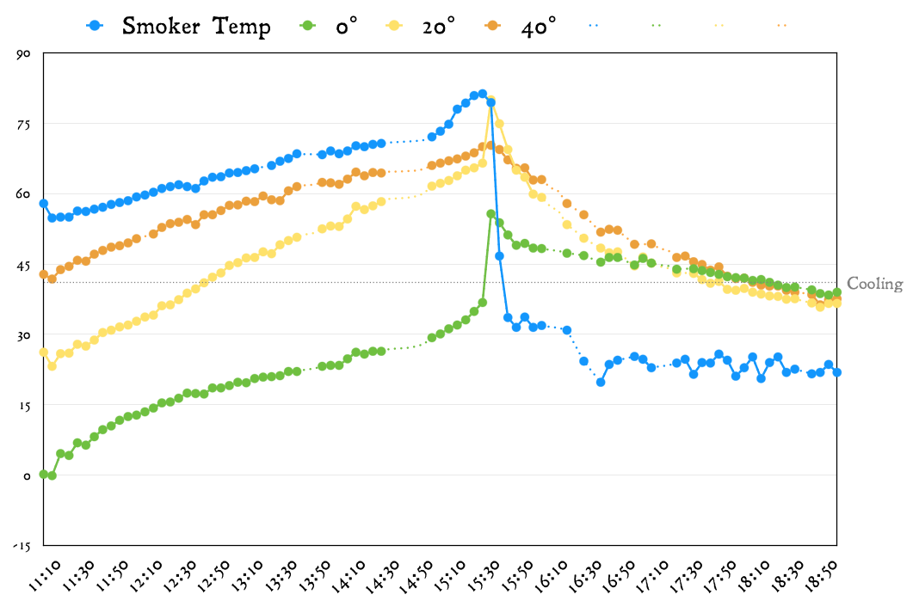

# igrill-combiner
Command line utility to combine probe data generated by the iGrill 2™ Thermometer

## Description
This tool allows you to export the individual CSV files from the iGrill app and
combine them into a single file with user-definable averaged periods. This results in
much easier generation of custom charts and logs.

Interpolated data is added in additional columns for gaps in the collected data
from the iGrill.  This is handy when you're out of range for a moment, or Bluetooth
decides to take a nap, or whatever. The "pure" data is still included, so you can
choose what to graph. Interpolated data is generated by looking for the next recorded
data point for the probe, then averaging the difference. While this should produce a
perfectly straight line, in practice it does not, because the data is rounded to the
nearest 0.1 for display.

## Usage

Once installed, use the following steps:

1. Create a new folder
2. Download all exported files from your cook to the new folder
3. `cd your/new/folder`
4. `php /path/to/combiner/combiner.php > output.csv`
5. Unless you want to get fancy, that's it!

## You Want to Get Fancy

Don't get too excited, this is just version 1.  This is more "ketchup AND mustard on
your hot dog fancy", not "OMG caviar" fancy :)

### Custom Period

By default, the output is combined into 120-second periods. To change this, simply
provide an integer as the first argument to the script.

`php combiner.php 600`

This example would generate 10-minute periods.  This would be useful for longer cooks.

To get your data combined without averages, use a period of 1.

`php combiner.php 1`

### Custom Time Format

By default, the output will include the hour and minute, in a 24-hour format. That
might be a problem for overnight cooks, for example, or if you specify a period shorter
than 60 seconds.

To change the format, just specify a second argument to the script.

`php combiner.php 120 H:i`

#### Example Time Formats

- US date, 24hr - `'n/j/y H:i'` (the quotation marks are important)
- Hours, minutes, and seconds, 24h - `H:i:s`

For full documentation of date options, see here - http://php.net/manual/en/function.date.php
